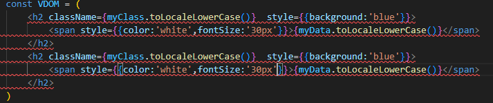

# JSX语法规则
### 
```
//ReactDOM.render(VDOM,document.querySelector('.exp'))     //react17以前版本渲染写法
const root = ReactDOM.createRoot(document.querySelector('.exp'))   //react18 渲染写法
root.render(VDOM)
```
1. 定义虚拟DOM时，不要写引号。
2. 标签中混入JS表达式时要用`{}`。
> - 表达式：一个表达式会产生一个值，可以放在任何需要一个值的地方。
>> 1.  a
>> 2. a+b
>> 3. demo(1)    //函数调用
>> 4. arr.map()
>> 5. function test(){}   //函数定义
> - 语句(代码)：
>> 1. if(){}
>> 2. for(){}
>> 3. switch(){case:}
3. 样式的类名指定不要用`class`,要用`className`。
4. 内联样式，要用`style={{key:value}}`的形式去写。
```
<span style={{color:'white',fontSize:'30px'}}></span>
```
5. 只有一个根标签  


6. 标签必须闭合
```
<input type="text" \>
```
7. 标签首字母
> 1.若小写字母开头，则将该标签转为html中同名元素，若html中无该标签对应的同名元素，则报错。

> 2.若大写字母开头，react就去渲染对应的组件，若组件没有定义，则报错。
